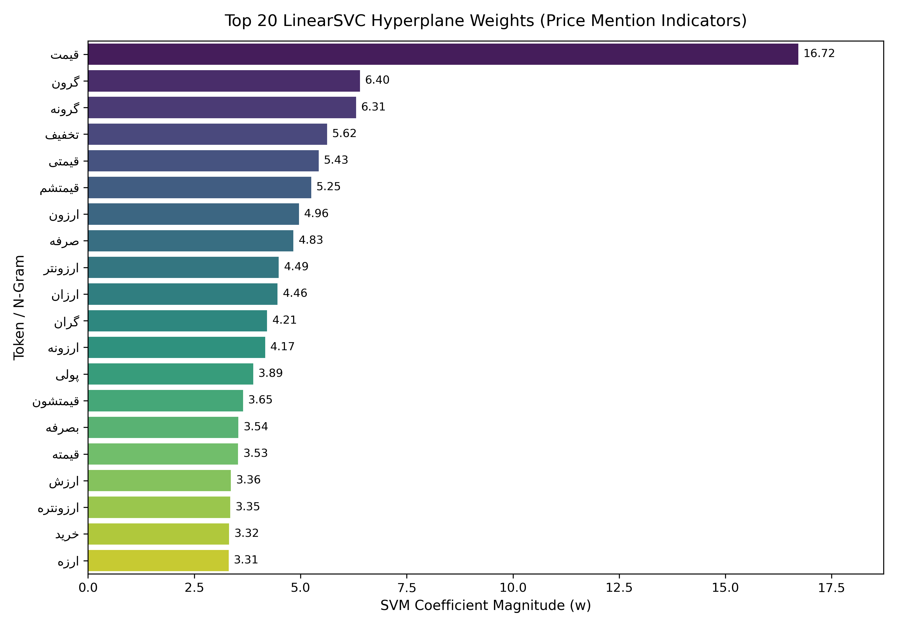

# Persian Review Metadata Extractor (Price Aspect Classification)


An end-to-end, modular Natural Language Processing (NLP) pipeline engineered to automatically classify and extract price-sensitivity metadata from large-scale Persian customer reviews.

---

## 1. Problem Statement & Business Value
High-volume digital platforms—such as e-commerce marketplaces, insurance portals, and financial services—receive thousands of unstructured user reviews daily. Manually auditing this text to monitor customer sentiment toward **pricing, fees, and perceived value** is unscalable.

This project implements a high-throughput text classification pipeline that determines whether a Persian review references pricing or financial value (`price_value = 1`) or discusses non-price product attributes (`price_value = 0`). The extracted binary metadata enables downstream analytics teams to:
* Isolate price-sensitive customer feedback for pricing strategy optimization.
* Monitor shifts in customer price perception across product categories.
* Feed structured aspect metadata into downstream recommendation and risk models.

---

## 2. Dataset & Feature Space Characteristics
The dataset comprises **48,000 labeled Persian customer reviews** (40,000 training records and 8,000 test records):
* **Class Distribution:** Well-balanced (`52.0%` Class `0` / `48.0%` Class `1`), avoiding the need for synthetic oversampling (e.g., SMOTE).
* **Vector Space Dimensionality:** Extracted using `TfidfVectorizer` (`max_features=25000`, `min_df=3`, `ngram_range=(1, 2)`), yielding a `(40000, 25000)` feature matrix.
* **Matrix Sparsity:** **99.88%** of the TF-IDF matrix entries are zero due to the short average length of user reviews relative to the 25,000-term vocabulary.

---

## 3. Preprocessing & Feature Engineering Architecture
Colloquial Persian text contains orthographic variations, missing zero-width non-joiners (ZWNJ), and diverse currency notations. The `PersianTextProcessor` class (`src/text_processor.py`) encapsulates a 4-stage cleaning pipeline:

1. **Unicode & ZWNJ Normalization:** Standardizes Arabic/Persian character variants (`ي`/`ی`, `ك`/`ک`) and repairs prefix/suffix spacing via `hazm.Normalizer`.
2. **Regex Financial Entity Masking:** Identifies numerical values paired with Persian currency/magnitude units (`تومان`, `تومن`, `ریال`, `هزار`, `میلیون`, `k`) and replaces them with semantic indicators (`PRICE_TOKEN`, `CUR_TOKEN`, `NUM_TOKEN`). This preserves financial signals while preventing vocabulary explosion from arbitrary numbers.
3. **Domain-Aware Stopword Filtering:** Removes high-frequency Persian stopwords while explicitly whitelisting price-indicative lexicon.
4. **Multi-Core Lemmatization:** Reduces inflected words to their dictionary roots via `hazm.Lemmatizer`, parallelized across all CPU cores using `pandarallel`.

---

## 4. Model Selection & Benchmarking

### Why Linear Models Over Tree Ensembles?
In a **99.88% sparse** feature space with 25,000 dimensions, tree-based ensemble methods (such as XGBoost or Random Forest) suffer from axis-aligned split inefficiency, high memory overhead, and overfitting on rare tokens. By contrast, high-dimensional text representations are well-suited for linear hyperplane separation.

### 5-Fold Stratified Cross-Validation (Raw TF-IDF Baseline)
We evaluated three candidate architectures on the 40,000-sample training set using 5-Fold Stratified Cross-Validation (`notebooks/01_eda_and_model_selection.ipynb`):

| Model | F1-Macro (Mean) | Accuracy (Mean) | Fit Time (s) | Engineering Verdict |
| :--- | :---: | :---: | :---: | :--- |
| **LinearSVC (`liblinear`)** | **0.8945** | **0.8949** | **0.29s** | **Selected:** Highest F1, optimal margin maximization in sparse space, fast convergence. |
| **Logistic Regression** | 0.8905 | 0.8912 | 0.14s | Strong runner-up; preferred when calibrated probabilities are strictly required. |
| **Multinomial Naive Bayes** | 0.8443 | 0.8448 | 0.02s | Fast baseline, but degraded by feature independence assumptions on bigrams. |

### Production Pipeline Performance (15% Holdout Validation — 6,000 Samples)
Integrating the full `PersianTextProcessor` (Hazm lemmatization + regex financial token masking) with `LinearSVC` in `src/train_pipeline.py` improved holdout performance to **90.0% F1-Macro**:

| Class | Precision | Recall | F1-Score | Support |
| :--- | :---: | :---: | :---: | :---: |
| **0 (No Price Mention)** | 0.89 | 0.92 | 0.91 | 3,120 |
| **1 (Price Mentioned)** | 0.91 | 0.88 | 0.90 | 2,880 |
| **Macro / Weighted Avg** | **0.90** | **0.90** | **0.90** | **6,000** |

---

## 5. Model Interpretability (Hyperplane Weights)
A core requirement in enterprise AI systems is model explainability. Unlike black-box neural or boosted-tree ensembles, `LinearSVC` learns an explicit linear decision boundary:

$$\mathbf{w}^T \mathbf{x} + b = 0$$

By inspecting the highest positive coefficients in the weight vector $\mathbf{w}$, we verify that predictions are driven by genuine domain signals (e.g., tokens corresponding to *price*, *toman*, *worth*, *discount*, *expensive*, and *cheap*).



---

## 6. Repository Structure

```text
persian-price-aspect-classifier/
├── assets/
│   └── feature_importance.png              # Top 20 SVM coefficient visualization
├── data/
│   └── README.md                           # Dataset placement instructions
├── models/                                 # Serialized .pkl model artifacts (Git-ignored)
├── notebooks/
│   └── 01_eda_and_model_selection.ipynb    # EDA, sparsity analysis, 5-Fold CV & interpretability
├── src/
│   ├── __init__.py
│   ├── text_processor.py                   # Object-oriented Hazm + Regex text cleaner
│   ├── train_pipeline.py                   # Parallelized training script with artifact caching
│   └── inference.py                        # Batch inference CLI script
├── .gitignore
├── requirements.txt
└── README.md
```

---

## 7. Quickstart & Usage

### 1. Clone & Install Dependencies
```bash
git clone [https://github.com/NasimNajand/persian-price-aspect-classifier.git](https://github.com/NasimNajand/persian-price-aspect-classifier.git)
cd persian-price-aspect-classifier
pip install -r requirements.txt
```

### 2. Train the Pipeline (with Artifact Caching)
Place `train.csv` and `test.csv` inside the `data/` directory. The training script automatically checks if `models/price_mention_model.pkl` exists to skip redundant training. Use `--force` to trigger a fresh training run:

```bash
cd src
python train_pipeline.py

# Force retrain and overwrite cached model:
python train_pipeline.py --force
```

### 3. Run Batch Inference
Generate predictions on `data/test.csv` and export results to `data/submission.csv`:

```bash
cd src
python inference.py \
  --model ../models/price_mention_model.pkl \
  --input ../data/test.csv \
  --output ../data/submission.csv
```